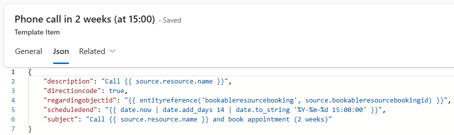
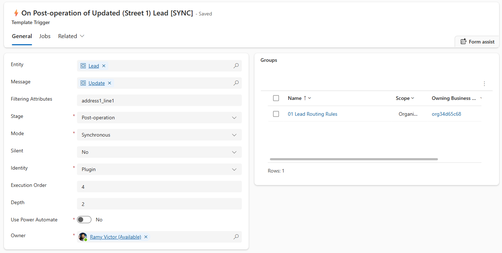
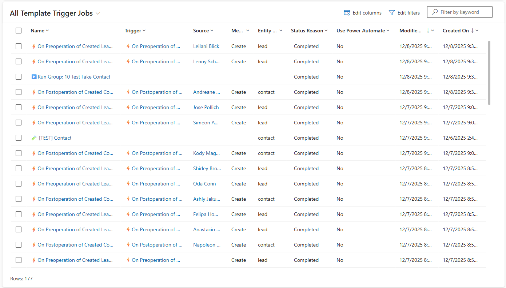

# Introduction
Template-driven automation of record operations within Power Apps. You can create a group of action templates that can run on trigger definition(s). Every group item represents a table record in Dataverse represented in a robust JSON editor to easily construct the table record using expressions. 

# Template Group
A group of template items. Defines the scope of actions and the  [source](appendix#source) type. A group can be filtered by a filtering expression.
## Conditional Template Group Filtering
Runs only if the source state is Active
```json
statecode != 1
```

# Template Item
The [target](appendix#target) table object definition in JSON.


```json
{
    "leadid": "{{ source.leadid }}",
    "new_expirydate": "{{ !source.address1_line1? (source.new_expirydate ?? date.now | date.add_years 2) : (source.new_expirydate ?? date.now | date.add_years 1) }}",
    "leadqualitycode": "{{ !source.address1_line1? 1 : 3}}"
}
```
## Conditional Template Item Filtering
Using "template:condition" property. Runs only if the source owning business unit has country code and source has an auto number.
```json
"template:condition": "{{ source.owningbusinessunit.xrm_countrycode && source.xrm_autonumber}}"
```
# Template Triggers
Table represents plugin processing steps. Each record represents an SDK step. 


# Template Jobs
Log of triggered groups. Every time an event is triggered by the template trigger definitions. A job is created for history. A job will run a group of items using a plugin step defined in the trigger table or will be executed by a Power Automate flow " [TemplateEngine] Apply Template Job"


# Schema

# Environment Variables
```json
{
    "url": "{{env.xrm_EnvironmentUrl}}"
}
```
# Navigation Properties

```json
{
    "xrm_countrycode": "{{source.owningbusinessunit.xrm_countrycode}}"
}
```
# Testing
Bogus
```json
{
    "emailaddress1": "{{faker.internet.email()}}"
}
```
# Rollback
On a job. Click "Roll Back" to delete records created by the job. That is useful for testing.
# Credits
- [Charles Llamas](https://github.com/Charlesllamas) for [Code Editor](https://github.com/Charlesllamas/Code-Editor-PCF) PCF component