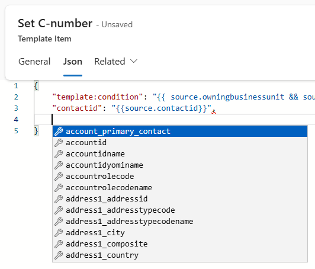
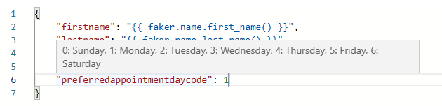

# Introduction 
Template-driven automation of record operations model-driven Power Apps application. A planned collection of operation request definitions.
You can create a group of action templates that can run on trigger definition(s). 
Every group item represents a table record in Dataverse represented in a robust JSON editor to easily construct the table record object definition. 

## Template Group
Group of template items (set of actions).Defines the scope of actions and the  [source](appendix#source) type. A group can be filtered by a filtering expression.
### Conditional Template Group Filtering
Runs only if the source state is Active
```json
statecode != 1
```

## Template Item
A table "[target](appendix#target)" object definition in JSON.


```json
{
    "leadid": "{{ source.leadid }}",
    "new_expirydate": "{{ !source.address1_line1? (source.new_expirydate ?? date.now | date.add_years 2) : (source.new_expirydate ?? date.now | date.add_years 1) }}",
    "leadqualitycode": "{{ !source.address1_line1? 1 : 3}}"
}
```
### Conditional Template Item Filtering
Using "template:condition" property. Runs only if the source owning business unit has country code and source has an auto number.
```json
"template:condition": "{{ source.owningbusinessunit.xrm_countrycode && source.xrm_autonumber}}"
```
## Template Triggers
Table represents plugin processing steps. Each record represents an SDK step. 
On save, a relationship is created for the polymorphic lookup on the json, if it does not exist, 1:N [target](appendix#target) record type specified in the trigger record.


## Template Jobs
Log of triggered groups. Every time an event is triggered by the template trigger definitions. A job is created for history. A job will run a group of items using a plugin step defined in the trigger table or will be executed by a Power Automate flow " [TemplateEngine] Apply Template Job"

### Source Popolymorphic Lookup
Template job is automatically related to the [target](appendix#target) record initated the job.
Therefore you can find all related job runs to a specific record.

## Monaco Editor for Template Items
The editor uses the Monaco Editor, providing intelligent suggestions and auto-completions for template expressions. As you type, the editor offers context-aware completions for properties like `source`, `env`, and `faker`, making it easy to construct dynamic expressions. For example, typing `source.` will suggest available fields from the source record, while `env.` provides environment variables, and `faker.` exposes bogus fake data generation for testing.

The schema functionality powers these suggestions, ensuring that only valid properties in all entities metadata and methods are shown based on your template item entity context.
### Schema

### Optionset (Picklist) Description

# Environment Variables
```json
{
    "url": "{{env.xrm_EnvironmentUrl}}"
}
```
## Navigation Properties
```json
{
    "xrm_countrycode": "{{source.owningbusinessunit.xrm_countrycode}}"
}
```
## Testing
Bogus
```json
{
    "emailaddress1": "{{faker.internet.email()}}"
}
```
## Rollback
On a job. Click "Roll Back" to delete records created by the job. That is useful for testing.