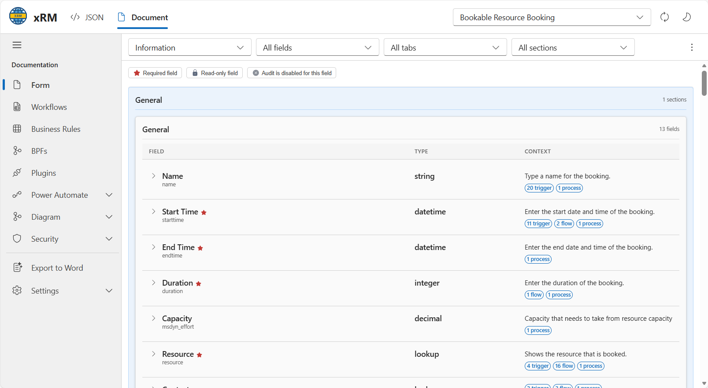
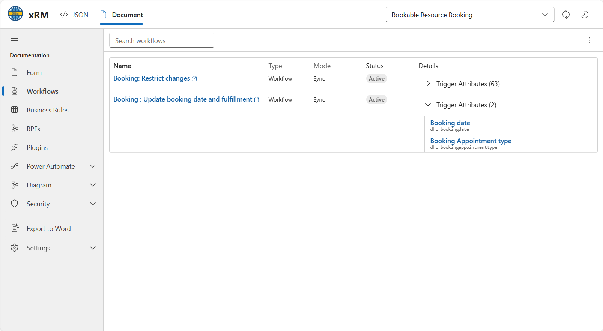
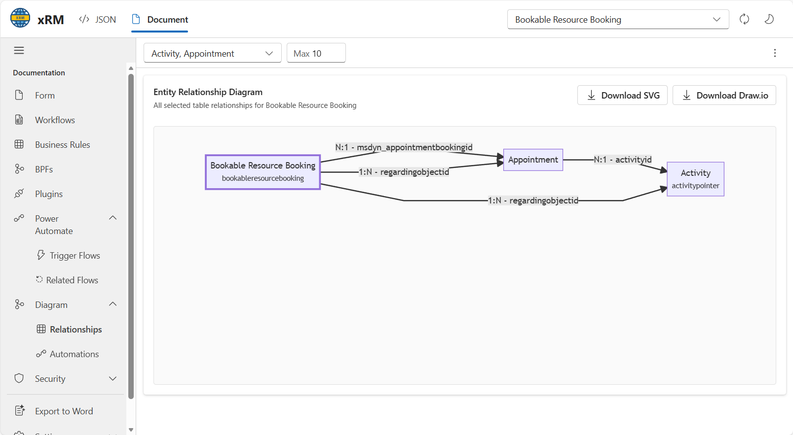
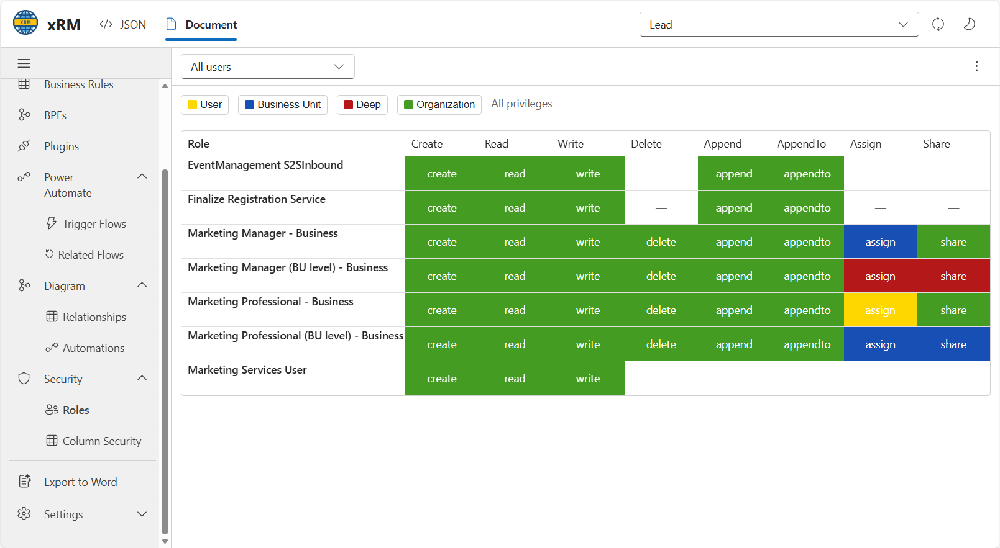

Documentation tools collect metadata from the current table and expose it through generated views. The output is intended for technical analysis rather than end-user documentation.

## Form documentation

The form documentation view lists fields on the selected form and cross references additional metadata for each field.

The form view supports:

- Form selection.
- Filtering by field, tab, and section.
- Visual indicators for required fields, read-only fields, and audit state.
- Context badges for related triggers, flows, and processes.

## Workflow cross reference

The workflow view shows automations related to the current table and can expand each item to list the triggering attributes.

The documentation navigation groups related automation surfaces under the same area:

- Workflows
- Business Rules
- BPFs
- Plugins
- Power Automate

## Relationship diagrams

The relationship view renders selected relationships as a diagram and supports export for reuse outside the extension.

Available actions shown in the UI include:

- Filtering the related entity types used in the diagram.
- Limiting the number of rendered nodes.
- Downloading the diagram as `SVG`.
- Downloading the diagram as `Draw.io`.

## Security views

The security area shows role access for the selected table and lets the result be filtered by user scope and privilege depth.

The matrix exposes privilege columns such as create, read, write, delete, append, append-to, assign, and share. The filter bar supports the security levels shown in the UI: User, Business Unit, Deep, and Organization.

## Export to Word

The extension can export the current documentation set to a Word document that includes the collected metadata. This is the same type of source document used to derive these pages.