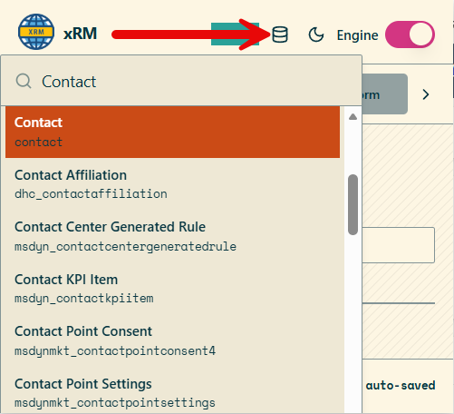

xRM MDA is a browser extension for Power Apps model-driven apps and maker pages. It combines naming rules, record helpers, metadata exploration, and generated documentation in a single extension UI.

## Main areas

- Naming Engine: applies naming rules for tables, columns, forms, web resources, and process artifacts.
- Productivity Tools: provides record actions, test-data helpers, JSON editing, and reusable templates.
- Documentation Tools: generates form-level documentation, workflow cross references, relationship diagrams, security views, and Word exports.

## Navigation explorer

The header includes a navigation explorer that searches tables from anywhere in the model-driven application. Selecting an item navigates to the selected table so you can move between metadata surfaces without opening the maker portal navigation manually.

## Metadata entry points

The extension exposes metadata tools in two places:

- List context: opens metadata tools for the entity behind the current view. Shortcut: `Alt+M`.
- Record context: opens metadata tools for the entity behind the currently opened record. Shortcut: `Alt+M`.

## Related pages

- See [Naming Engine](./naming-engine.md) for rule configuration and supported contexts.
- See [Productivity Tools](./productivity-tools.md) for shortcuts, record actions, and the JSON object manipulator.
- See [Documentation Tools](./documentation-tools.md) for generated documentation, diagrams, and security views.
