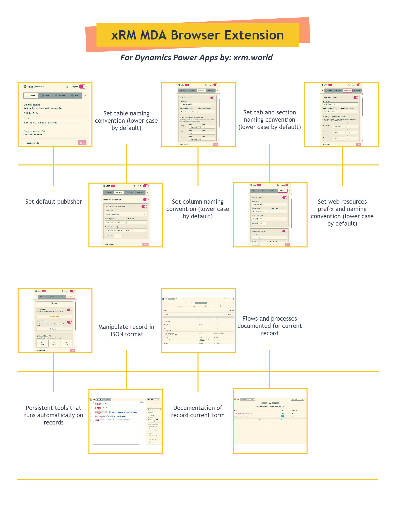

# xRM MDA for Power Apps

## Naming Engine

The naming engine is the core feature of xRM MDA. It watches for keystrokes in the Power Apps Maker Portal and auto-formats target fields (Schema Name, Logical Name, Unique Name) based on your configured rules and organization naming conventions.

## How it works

1. You type a **Display Name** in any supported editor (table, column, form, web resource)
2. The engine detects the current context and finds matching rules
3. Each rule transforms the display name through a pipeline and writes the result to the target field
4. Results appear instantly as you type

## Supported contexts

| Context | Source field | Target field(s) |
|---------|-------------|-----------------|
| **Table** | Display Name | Schema Name |
| **Column** | Display Name | Schema Name |
| **Form** | Tab Label / Section Label | Tab Name / Section Name |
| **Web Resource** | Display Name | Name (path + extension) |
| **Processes** | Display Name | Unique Name |

## Data type variants

For **columns** and **web resources**, the engine supports type-specific prefix/suffix overrides:

### Column variants

| Data type | Default prefix | Default suffix |
|-----------|---------------|---------------|
| Lookup | | `id` |
| Yes/No | `is` | |
| Choice | | |
| Text | | |

### Web resource variants

Each file type gets its own path prefix and extension suffix:

| File type | Path prefix | Extension |
|-----------|------------|-----------|
| JavaScript | `/scripts/` | `.js` |
| CSS | `/css/` | `.css` |
| HTML | `/html/` | `.html` |
| XML | `/xml/` | `.xml` |
| PNG | `/images/` | `.png` |
| JPG | `/images/` | `.jpg` |
| GIF | `/images/` | `.gif` |
| SVG | `/images/` | `.svg` |
| ICO | `/images/` | `.ico` |
| XSL | `/xsl/` | `.xsl` |
| RESX | `/resx/` | `.resx` |

## Publisher prefix mismatch warning

When editing a column, if the page's publisher prefix decoration differs from your configured global prefix, the engine displays a yellow warning banner below the target field.

## Engine toggle

Use the power button in the popup header to pause/resume the naming engine without changing any rules. This is useful when you need to type a name manually without auto-formatting.
