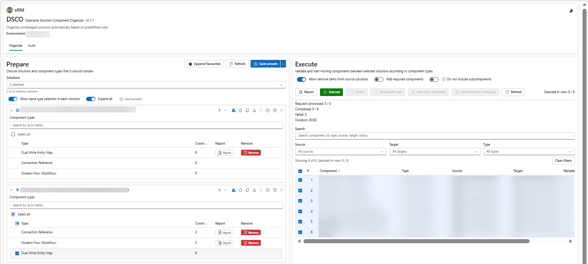

## Overview

The Dataverse Solution Component Organizer (DSCO) is designed to organize the process of moving components from a unmanaged solutions into specific target solutions based on their type. This reduces the manual effort required to keep solutions clean and organized.

## Organize

The organization interface allows you to map component types (like Tables, Flows, or Web Resources) to specific solutions.

- **Source Selection**: Identify the solutions containing components that need to be moved.
- **Component Filtering**: Filter components by type, prefix, or date modified.
- **Presets**: Save your mapping configurations (e.g., "All Flows to Solution A", "All Tables to Solution B") to run them again with a single click.
- **Execution**: The extension performs the `AddSolutionComponent` and `RemoveSolutionComponent` operations via the Web API to migrate the items.

## Audit

The Audit tool provides visibility into recent environment changes, helping leads and makers track what has been modified.

- **Time Intervals**: View actions made in the last hour, day, or a custom range.
- **Maker Tracking**: See which user modified specific components.

