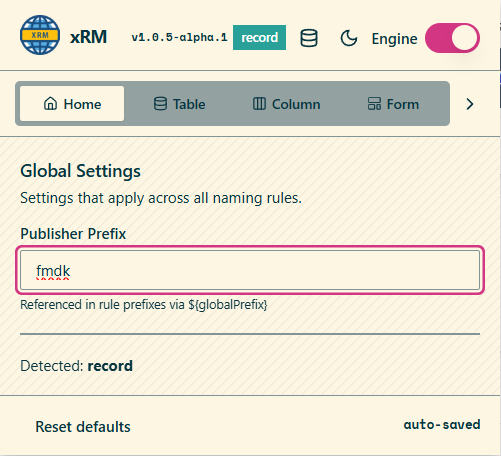
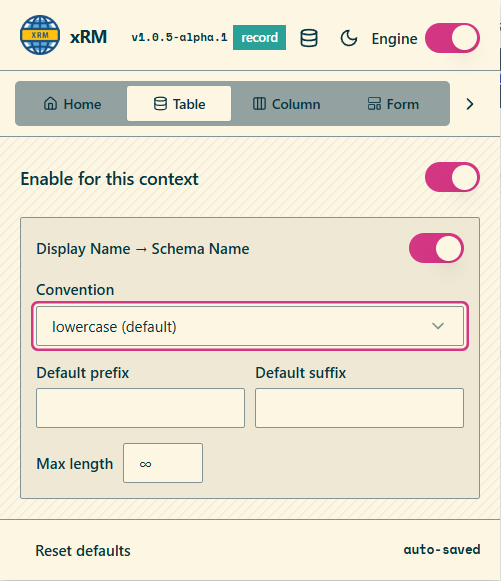
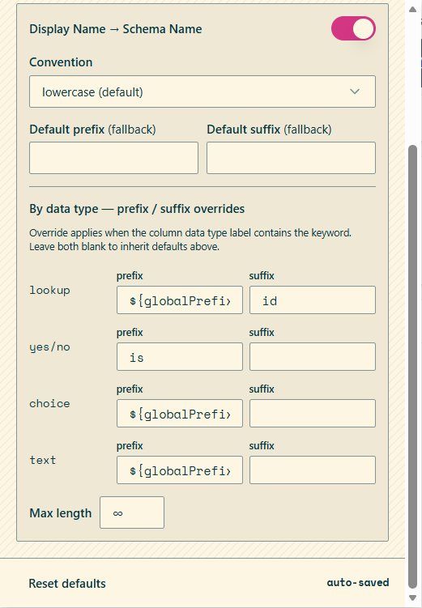
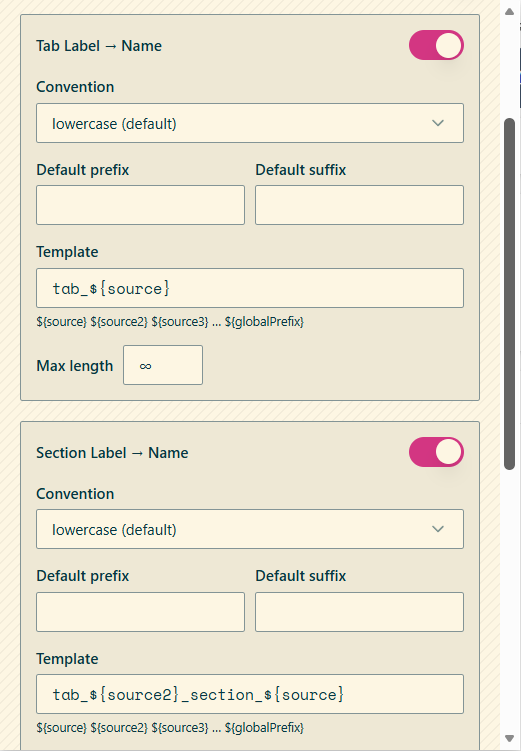
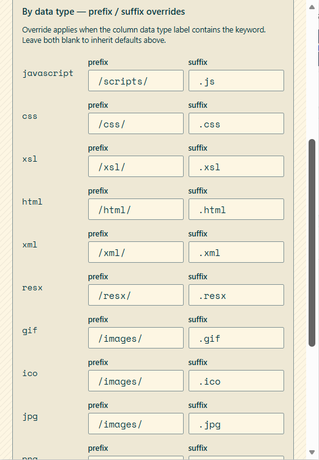

The naming engine watches supported maker forms and writes generated names to target fields as the source label changes. Rules are grouped by context and are saved automatically in extension storage.

## Global settings

Global settings define the publisher prefix used across naming rules. The prefix can be referenced from rule templates through `${globalPrefix}`.

If the maker page indicates a different publisher prefix than the configured global prefix, the extension shows a warning so the component is not created under the wrong publisher.

## Supported contexts

| Context | Source | Target |
|---|---|---|
| Table | Display Name | Schema Name |
| Column | Display Name | Schema Name |
| Form tab | Tab Label | Name |
| Form section | Section Label | Name |
| Web resource | Display Name | Name |
| Process | Display Name | Unique Name |

## Table rules

Table rules define how a display name becomes a schema name. A rule can be enabled or disabled per context and can apply a convention, a prefix, a suffix, and a maximum length.

## Column rules

Column rules support both fallback values and data-type-specific overrides. When an override matches the displayed column data type label, its prefix or suffix is applied instead of the fallback value.

### Column data-type overrides

| Data type keyword | Typical use |
|---|---|
| `lookup` | Append `id` or another relationship suffix |
| `yes/no` | Apply boolean prefixes such as `is` |
| `choice` | Apply publisher or domain prefixes |
| `text` | Apply default text naming rules |

## Form rules

Form rules generate names for form tabs and sections. In addition to convention, prefix, suffix, and max length, form rules support templates with token substitution.

Supported template tokens shown in the UI include:

- `${source}`
- `${source2}`
- `${source3}`
- `${globalPrefix}`

These tokens let a rule compose names from the current label and previously resolved source segments.

## Web resource rules

Web resource rules generate both path prefixes and file extensions based on file type.

| File type keyword | Prefix | Suffix |
|---|---|---|
| `javascript` | `/scripts/` | `.js` |
| `css` | `/css/` | `.css` |
| `xsl` | `/xsl/` | `.xsl` |
| `html` | `/html/` | `.html` |
| `xml` | `/xml/` | `.xml` |
| `resx` | `/resx/` | `.resx` |
| `gif` | `/images/` | `.gif` |
| `ico` | `/images/` | `.ico` |
| `jpg` | `/images/` | `.jpg` |
| `png` | `/images/` | `.png` |
| `svg` | `/images/` | `.svg` |

## Process rules

Process rules use the same naming model to generate process unique names from the display name. This keeps process artifacts aligned with the same publisher and convention settings used for tables, columns, and forms.

## Runtime behavior

- The engine can be toggled from the popup header without changing saved rules.
- Rule changes are auto-saved.
- Default values can be restored from the reset action in each settings screen.