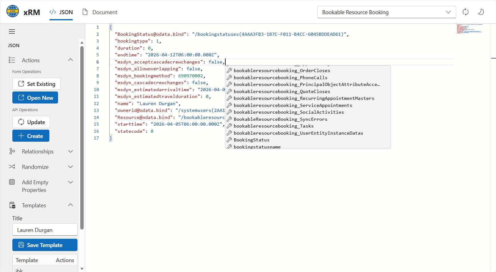

Productivity tools are available when working with records and metadata screens. They focus on reducing manual test setup, exposing record data quickly, and keeping helper states persistent across pages.

## 9. Keyboard Shortcuts

All shortcuts work on record pages without opening the popup.

| Shortcut | Action |
|----------|--------|
| `Alt+I` | Copy Record ID |
| `Alt+U` | Copy Record URL |
| `Alt+C` | Clone Record |
| `Alt+W` | Open Web API |
| `Alt+F` | Fake fill (focused field or full form) |
| `Alt+G` | Godmode (one-shot) |
| `Alt+N` | Toggle Show Names (one-shot) |
| `Alt+M` | Open Metadata Tools (JSON viewer) |
| `Alt+Shift+F` | Fake fill new record |
| `Alt+Shift+M` | Open the current environment in Maker portal |
| `Alt+Shift+P` | Open the current environment flows page |

### Metadata Tools Deep Links

These shortcuts open Metadata Tools directly on the matching hash route.

| Shortcut | Hash target |
|----------|-------------|
| `Alt+Shift+J` | `#json` |
| `Alt+Shift+D` | `#document/form` |
| `Alt+Shift+T` | `#document/trigger-flows` |
| `Alt+Shift+R` | `#document/power-automate/related-flows` |
| `Alt+Shift+W` | `#document/workflows` |
| `Alt+Shift+B` | `#document/business-rules` |
| `Alt+Shift+L` | `#document/diagram/relationships` |
| `Alt+Shift+S` | `#document/security/roles` |
| `Alt+Shift+C` | `#document/security/column-security` |
| `Alt+Shift+E` | `#document/settings/export` |

## Persistent helpers

The extension keeps helper state available across pages so repeated testing does not require reopening the popup.

- Templates can store form values for later reuse on test records.
- God mode can stay enabled across navigation.
- Logical name overlays can stay enabled without reopening the extension UI.

## JSON object manipulator

The JSON object manipulator opens a record editor for inspecting and changing record payloads directly. It is intended for testing, metadata inspection, and template creation.

The screen includes:

- Form operations for opening existing records or creating new ones.
- API operations for update and create requests.
- Relationship helpers.
- Randomization tools for populating fields.
- Empty-property insertion.
- Template storage with save and action tabs.

## Record testing flow

A typical test flow is:

1. Open a record or create a new one.
2. Use the JSON object manipulator or fake-value shortcut to populate fields.
3. Save the result as a template if the same setup is reused.
4. Reapply the template or randomizer on the next test record.