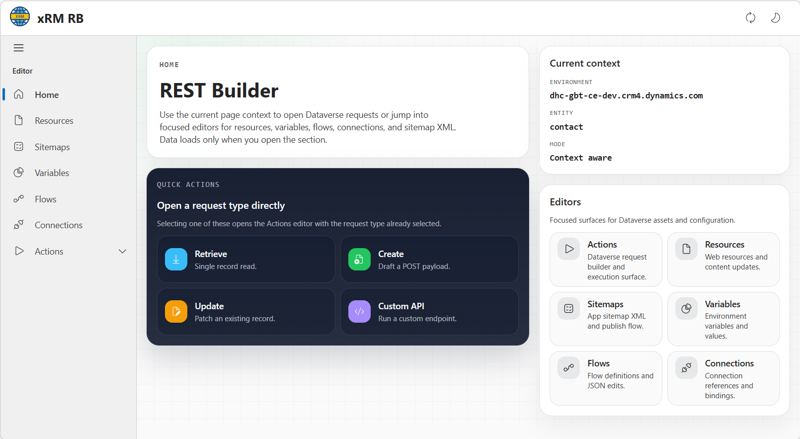
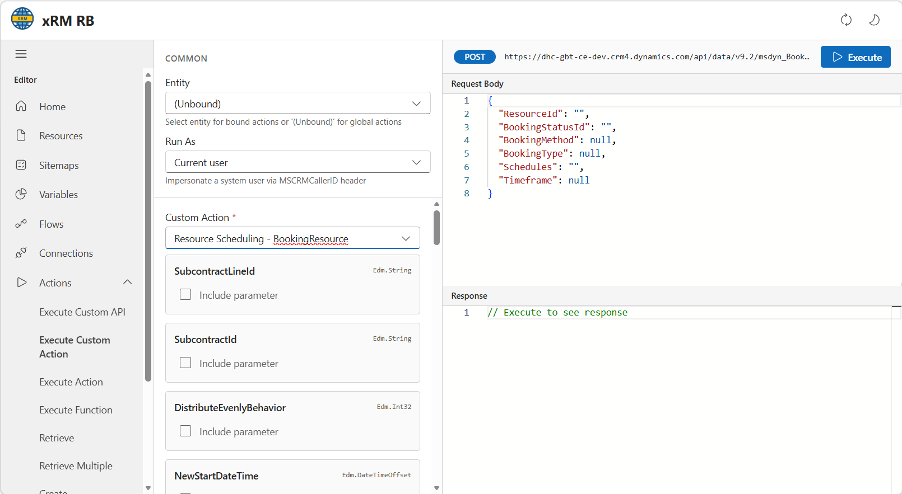

## Dynamic Payloads

The REST Builder supports **Dynamic JSON Expressions** for Create and Update operations. This allows you to use helpers like `{{now()}}`, `{{rand(min, max)}}`, or `${fake}` directly within your JSON request body.

For more details on supported syntax and available functions, see the [Json Expressions](./json-expressions.md) page.

## Raw Edit

The Raw Edit feature provides a direct JSON/XML editor for system components that are often difficult to modify quickly:

- **Web Resources**: Edit content directly.
- **Site Maps**: Modify navigation XML.
- **Environment Variables**: Update values across environments.
- **Flows & Connections**: Inspect and modify underlying definitions.

