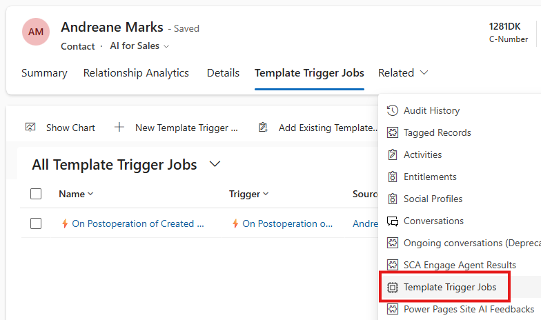
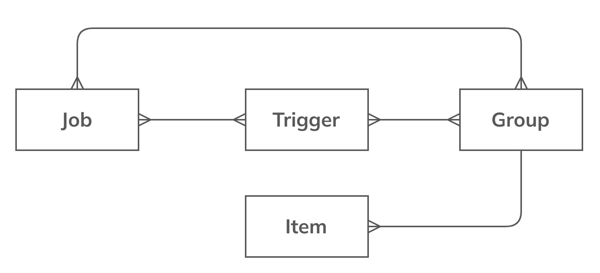
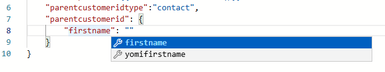

# Template Engine 
**Template-driven automation** for record operations within a model-driven Power Apps application. The core functionality involves creating a **planned collection of operation requests**, or Action Templates (definition based), which are organized into groups that execute automatically based on defined trigger(s). Every item in an action group represents a specific **table record definition in Dataverse**, which users can easily and precisely construct using a **robust JSON editor** to define the necessary table record object.


## Template Group
Group of template items (set of actions).Defines the scope of actions and the  [source](appendix#source) type. A group can be filtered by a filtering expression.
### Conditional Template Group Filtering
Runs only if the source state is Active
```json
statecode != 1
```

## Template Item
A table "[target](appendix#target)" object definition in JSON.


```json
{
    "leadid": "{{ source.leadid }}",
    "new_expirydate": "{{ !source.address1_line1? (source.new_expirydate ?? date.now | date.add_years 2) : (source.new_expirydate ?? date.now | date.add_years 1) }}",
    "leadqualitycode": "{{ !source.address1_line1? 1 : 3}}"
}
```
### Conditional Template Item Filtering
Using the `TemplateEngine.Condition` property. Runs only if the source owning business unit has country code and the source has an auto number.
```json
"TemplateEngine": {
    "Condition": "{{ source.owningbusinessunit.xrm_countrycode && source.xrm_autonumber }}"
}
```
## Template Triggers
Table represents plugin processing steps. Each record represents a plugin step. 
On save, a relationship is created for the polymorphic lookup on the json, if it does not exist, 1:N [target](appendix#target) record type specified in the trigger record.


## Template Jobs
Log of triggered groups. Every time an event is triggered by the template trigger definitions. A job is created for history. A job will run a group of items using a plugin step defined in the trigger table or will be executed by a Power Automate flow " [TemplateEngine] Apply Template Job"


### Source Popolymorphic Lookup
Template job is automatically related to the [target](appendix#target) record initated the job.
Therefore you can find all related job runs to a specific record.



## Entity Relationship Diagram ERD
**Relationships:**
- Group → Items: One-to-Many (1:N)
- Group → Triggers: Many-to-Many (N:N)
- Group → Jobs: Many-to-Many (N:N)
- Triggers → Jobs: Many-to-Many (N:N)


**Group Structure:**
- **Items**: One group has many items (1:N)
- **Triggers**: Many-to-many relationship with groups (N:N)
- **Jobs**: Many-to-many relationship with both groups (N:N) and triggers (N:N)
## Monaco Editor for Template Items
The editor uses the Monaco Editor, providing intelligent suggestions and auto-completions for template expressions. As you type, the editor offers context-aware completions for properties like `source`, `env`, and `faker`, making it easy to construct dynamic expressions. For example, typing `source.` will suggest available fields from the source record, while `env.` provides environment variables, and `faker.` exposes bogus fake data generation for testing.

The schema functionality powers these suggestions, ensuring that only valid properties in all entities metadata and methods are shown based on your template item entity context.
### Schema

### Optionset (Picklist) Description

### Polymorphic Objects
Depending on the `{{attribute field}}type` field the object autocomplete switches


# Environment Variables
```json
{
    "url": "{{env.xrm_EnvironmentUrl}}"
}
```
## Navigation Properties
```json
{
    "xrm_countrycode": "{{source.owningbusinessunit.xrm_countrycode}}"
}
```
## Testing
Mock fake records to automate test scenarios with fake information
```json
{
    "emailaddress1": "{{faker.internet.email()}}"
}
```
## Full Fake Contact Item
```json
{
    "firstname": "{{faker.name.first_name()}}",
    "lastname": "{{faker.name.last_name()}}",
    "description": "{{faker.lorem.paragraph()}}",
    "emailaddress1": "{{faker.internet.email()}}",
    "telephone1": "{{ faker.phone.phone_number() | string.truncate 20 }}",
    "new_clinicid": {
        "new_name": "{{ faker.name.full_name() }} {{faker.pick_random(['US','DK','NL','DE','FR'])}} Clinic"
    },
    "originatingleadid": {
        "address1_city": "{{faker.address.city()}}",
        "address1_country": "{{faker.address.country()}}",
        "address1_line1": "{{faker.address.street_address()}}",
        "address1_stateorprovince": "{{faker.address.state()}}",
        "emailaddress1": "{{faker.internet.email()}}",
        "firstname": "{{faker.name.first_name()}}",
        "lastname": "{{faker.name.last_name()}}",
        "mobilephone": "{{faker.phone.phone_number() | string.truncate 20}}",
        "subject": "{{faker.lorem.sentence()}}",
        "telephone1": "{{faker.phone.phone_number()}}",
        "websiteurl": "{{faker.internet.url()}}"
    },
    "lead_parent_contact": [
        {
            "address1_city": "{{faker.address.city()}}",
            "address1_country": "{{faker.address.country()}}",
            "address1_stateorprovince": "{{faker.address.state()}}",
            "emailaddress1": "{{faker.internet.email()}}",
            "firstname": "{{faker.name.first_name()}}",
            "lastname": "{{faker.name.last_name()}}",
            "mobilephone": "{{faker.phone.phone_number() | string.truncate 20}}",
            "subject": "{{faker.lorem.sentence()}}",
            "telephone1": "{{faker.phone.phone_number()}}",
            "websiteurl": "{{faker.internet.url()}}"
        }
    ],
    "parentcustomeridtype": "account",
    "parentcustomerid": {
        "name": "{{ faker.name.full_name() }}",
        "address1_city": "{{ faker.address.city() }}",
        "address1_country": "{{ faker.address.country() }}",
        "address1_line1": "{{ faker.address.street_address() }}",
        "address1_postalcode": "{{ faker.address.zip_code() }}",
        "address1_stateorprovince": "{{ faker.address.state() }}",
        "description": "{{ faker.company.catch_phrase() }} {{ faker.lorem.sentence() }}",
        "fax": "{{ faker.phone.phone_number() }}",
        "telephone1": "{{ faker.phone.phone_number() }}",
        "websiteurl": "{{ faker.internet.url() }}"
    },
    "account_primary_contact": [
        {
            "name": "{{ faker.name.full_name() }}",
            "address1_city": "{{ faker.address.city() }}",
            "address1_country": "{{ faker.address.country() }}",
            "address1_line1": "{{ faker.address.street_address() }}",
            "address1_postalcode": "{{ faker.address.zip_code() }}",
            "address1_stateorprovince": "{{ faker.address.state() }}",
            "description": "{{ faker.company.catch_phrase() }} {{ faker.lorem.sentence() }}",
            "fax": "{{ faker.phone.phone_number() }}",
            "telephone1": "{{ faker.phone.phone_number() }}",
            "websiteurl": "{{ faker.internet.url() }}"
        }
    ],
    "contact_tasks": [
        {
            "description": "{{faker.lorem.paragraphs()}}",
            "scheduledend": "{{date.now | date.add_days 28}}",
            "subject": "{{faker.lorem.sentence()}}"
        },
        {
            "description": "{{faker.lorem.paragraphs()}}",
            "scheduledend": "{{ date.now | date.add_days 14 | date.to_string '%Y-%m-%d 15: 00: 00' }}",
            "subject": "{{faker.lorem.sentence()}}"
        }
    ]
}
```
## Rollback
On a job. Click "Roll Back" to delete records created by the job. That is useful for testing.